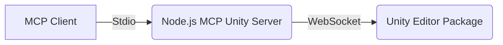

# MCP Unity Project Analysis

This document provides a comprehensive analysis of the `mcp-unity` project, detailing its architecture, components, communication flow, setup, and key functionalities.

## 1. Introduction

The `mcp-unity` project serves as a bridge between the Model Context Protocol (MCP) client and the Unity Editor. It enables external applications (like an MCP client) to interact with a running Unity instance, allowing for the execution of commands, retrieval of information, and automation of tasks within the Unity Editor.

The project consists of two main parts:
1.  A Unity Editor package (C#) that runs within the Unity Editor.
2.  A Node.js server (TypeScript) that communicates with the MCP client via standard I/O and with the Unity Editor via WebSockets.

## 2. Architecture Overview

The architecture is based on a client-server model with an intermediary Node.js server:

*   **MCP Client:** An external application that interacts with the `mcp-unity` server using the Model Context Protocol over standard I/O.
*   **Node.js MCP Unity Server:** A TypeScript application that acts as the main server. It receives requests from the MCP client, translates them into commands or queries for the Unity Editor, communicates with the Unity Editor via WebSocket, receives responses, and sends results back to the MCP client. It also registers available tools and resources with the MCP client.
*   **Unity Editor Package:** A C# assembly that runs within the Unity Editor. It hosts a WebSocket server, listens for commands/queries from the Node.js server, executes them within the Unity environment, and sends results back via WebSocket. It implements specific "Tools" for actions and "Resources" for data retrieval.

## 3. Communication Flow

Communication within the `mcp-unity` project occurs in two main stages:

### 3.1. Node.js Server - MCP Client Communication

*   The Node.js server communicates with the MCP client using standard input/output (Stdio).
*   This communication follows the Model Context Protocol, which is built upon JSON-RPC 2.0.
*   The Node.js server registers its capabilities (Tools, Resources, Prompts) with the MCP client upon startup.
*   The MCP client sends requests (method calls) to the Node.js server via Stdio.
*   The Node.js server processes these requests, potentially interacts with the Unity Editor, and sends responses (results or errors) back to the MCP client via Stdio.

### 3.2. Node.js Server - Unity Editor Communication

*   The Node.js server communicates with the Unity Editor package via a WebSocket connection.
*   The Unity Editor package hosts a WebSocket server (`McpUnityServer.cs`) listening on a configurable port (default 8090).
*   The Node.js server (`mcpUnity.ts`) acts as a WebSocket client, connecting to the Unity Editor's WebSocket server.
*   Communication over WebSocket also uses a JSON-RPC 2.0 like structure, with requests containing a `method`, `params`, and `id`, and responses containing `id`, `result`, or `error`.
*   The Node.js server sends requests to the Unity Editor to execute specific tools or fetch resources.
*   The Unity Editor executes the requested action using its internal C# implementations and sends the result or any errors back to the Node.js server.
*   The `mcpUnity.ts` class in the Node.js server manages the WebSocket connection, handles sending requests, processes incoming responses, and manages pending requests with timeouts.

## 4. Unity Editor Component (C#)

The Unity Editor component is implemented as a Unity package. Its core functionality resides within the `Editor` directory.

*   **Assembly Definition (`mcp-unity/Editor/McpUnity.Editor.asmdef`):** Defines a managed assembly for the Unity Editor code, ensuring proper compilation and referencing within the Unity project. It is configured to only include the "Editor" platform.
*   **`McpUnityServer.cs` (`mcp-unity/Editor/UnityBridge/McpUnityServer.cs`):**
    *   This is the central class for the Unity side of the communication.
    *   It is a singleton (`Instance`) initialized automatically when Unity loads (`[InitializeOnLoad]`).
    *   It manages the lifecycle of the `WebSocketServer` from the `websocket-sharp` library.
    *   It registers available `McpToolBase` and `McpResourceBase` implementations.
    *   It provides methods (`TryGetTool`, `TryGetResource`) for the `McpUnitySocketHandler` to retrieve the appropriate handler for incoming requests.
    *   It also initializes and holds references to services like `TestRunnerService` and `ConsoleLogsService`.
*   **`McpUnitySocketHandler.cs` (`mcp-unity/Editor/UnityBridge/McpUnitySocketHandler.cs`):**
    *   This class handles individual WebSocket connections and incoming messages.
    *   It receives raw WebSocket messages, parses them as JSON, and extracts the `method`, `params`, and `id`.
    *   It uses `EditorCoroutineUtility.StartCoroutineOwnerless` to dispatch the execution of Tools and fetching of Resources to Unity's main thread, ensuring thread safety for Unity API calls.
    *   It calls the appropriate `Execute` (for Tools) or `Fetch` (for Resources) method on the retrieved handler.
    *   It formats the result or error into a JSON-RPC 2.0 response and sends it back to the connected WebSocket client (the Node.js server).
    *   It handles WebSocket connection events (`OnOpen`, `OnClose`, `OnError`).
*   **Unity Tools (`McpToolBase`):**
    *   Classes inheriting from `McpToolBase` represent actions that can be performed within the Unity Editor.
    *   They have a `Name` and `Description`.
    *   They implement an `Execute` method (or `ExecuteAsync` for asynchronous operations) that takes `JObject` parameters and returns a `JObject` result.
    *   Example: [`MenuItemTool.cs`](mcp-unity/Editor/Tools/MenuItemTool.cs) executes a Unity Editor menu item given its path.
*   **Unity Resources (`McpResourceBase`):**
    *   Classes inheriting from `McpResourceBase` represent data that can be retrieved from the Unity Editor.
    *   They have a `Name`, `Description`, and `Uri`.
    *   They implement a `Fetch` method (or `FetchAsync` for asynchronous operations) that takes `JObject` parameters and returns a `JObject` result containing the requested data.
    *   Example: [`GetHierarchyResource.cs`](mcp-unity/Editor/Resources/GetHierarchyResource.cs) retrieves the hierarchy of GameObjects in the currently loaded scenes.
*   **Services:** Classes like `TestRunnerService` and `ConsoleLogsService` provide access to specific Unity functionalities.
*   **Utils:** Helper classes like `Logger`, `McpConfigUtils`, and `VsCodeWorkspaceUtils` provide common utilities.

## 5. Node.js Server Component (TypeScript)

The Node.js server is implemented in TypeScript and uses the MCP SDK. Its code is located in the `Server~` directory.

*   **`package.json` (`mcp-unity/Server~/package.json`):**
    *   Defines the Node.js project metadata, dependencies (including `@modelcontextprotocol/sdk`, `ws` for WebSockets, `express`, `zod`, etc.), and scripts (`build`, `start`, `watch`, `inspector`).
    *   Specifies the entry point as `build/index.js` and the type as `module`.
*   **`tsconfig.json` (`mcp-unity/Server~/tsconfig.json`):**
    *   Configures the TypeScript compiler options, specifying the target JavaScript version (`ES2022`), module system (`NodeNext`), output directory (`./build`), and source directory (`./src`).
*   **`index.ts` (`mcp-unity/Server~/src/index.ts`):**
    *   The main entry point of the Node.js server.
    *   Initializes the `McpServer` from the MCP SDK.
    *   Initializes the `McpUnity` class to handle communication with the Unity Editor.
    *   Registers all available Node.js Tools, Resources, and Prompts with the `McpServer`.
    *   Sets up the `StdioServerTransport` to communicate with the MCP client.
    *   Starts the `McpServer` and the `McpUnity` WebSocket client connection.
    *   Includes basic error handling and process shutdown logic.
*   **`mcpUnity.ts` (`mcp-unity/Server~/src/unity/mcpUnity.ts`):**
    *   Manages the WebSocket connection to the Unity Editor.
    *   Determines the Unity WebSocket port from environment variables or Windows Registry.
    *   Provides `start` and `stop` methods to manage the connection lifecycle.
    *   Implements `sendRequest` to send JSON-RPC 2.0 requests to the Unity Editor and handle responses or timeouts.
    *   Manages a map of pending requests to match responses with their original requests.
    *   Includes logic for handling connection errors and retries.
*   **Node.js Tools:**
    *   TypeScript modules (e.g., `mcp-unity/Server~/src/tools/menuItemTool.ts`) that register corresponding Unity C# Tools with the `McpServer`.
    *   They define the tool's name, description, and parameters schema using `zod`.
    *   They implement a handler function that calls `mcpUnity.sendRequest` to forward the request to the Unity Editor and formats the Unity response into the MCP `CallToolResult` format.
    *   Example: [`menuItemTool.ts`](mcp-unity/Server~/src/tools/menuItemTool.ts) registers the `execute_menu_item` tool.
*   **Node.js Resources:**
    *   TypeScript modules (e.g., `mcp-unity/Server~/src/resources/getHierarchyResource.ts`) that register corresponding Unity C# Resources with the `McpServer`.
    *   They define the resource's name, URI, description, and MIME type.
    *   They implement a handler function that calls `mcpUnity.sendRequest` to fetch the resource data from the Unity Editor and formats the Unity response into the MCP `ReadResourceResult` format.
    *   Example: [`getHierarchyResource.ts`](mcp-unity/Server~/src/resources/getHierarchyResource.ts) registers the `get_hierarchy` resource.
*   **Prompts:** The `prompts/` directory contains definitions for prompts that can be registered with the MCP server, likely used for guiding AI models interacting with the server.
*   **Utils:** Helper modules like `logger.ts` and `errors.ts` provide logging and custom error handling.

## 6. Setup

Setting up `mcp-unity` involves two main parts:

1.  **Unity Editor Package:** The `mcp-unity` directory should be placed within the `Assets` or `Packages` directory of a Unity project. Unity will automatically compile the C# code in the `Editor` directory.
2.  **Node.js Server:**
    *   Navigate to the `mcp-unity/Server~` directory in a terminal.
    *   Install dependencies: `npm install`
    *   Build the TypeScript code: `npm run build`
    *   The server can then be started using `npm start`.
    *   Ensure the Unity Editor is running and the `McpUnityServer` is started within the Editor (this might be automatic via `InitializeOnLoad` or require manual activation depending on settings).
    *   The Node.js server will attempt to connect to the Unity Editor via WebSocket on the configured port.

## 7. Key Functionalities

Based on the registered Tools and Resources, `mcp-unity` provides the following key functionalities to an MCP client:

*   **Execute Menu Items:** Trigger actions in the Unity Editor by executing menu items (e.g., creating GameObjects, saving scenes).
*   **Select GameObjects:** Select specific GameObjects in the Unity Hierarchy.
*   **Add Packages:** Add packages to the Unity project via the Package Manager.
*   **Run Tests:** Execute Unity Play Mode or Edit Mode tests.
*   **Send Console Logs:** Send messages to the Unity Editor console.
*   **Update Components:** Modify properties of components on GameObjects.
*   **Add Assets to Scene:** Instantiate prefabs or other assets into the current scene.
*   **Get Menu Items:** Retrieve a list of available menu items in the Unity Editor.
*   **Get Console Logs:** Retrieve logs from the Unity Editor console.
*   **Get Hierarchy:** Retrieve the structure and details of GameObjects in the loaded scenes.
*   **Get Packages:** Retrieve a list of packages installed in the Unity project.
*   **Get Assets:** Retrieve information about assets in the Unity project.
*   **Get Tests:** Retrieve a list of available tests in the Unity project.
*   **Get GameObject:** Retrieve detailed information about a specific GameObject.

This documentation provides a foundational understanding of the `mcp-unity` project, its structure, and how its components interact to enable external control and inspection of the Unity Editor via the Model Context Protocol.